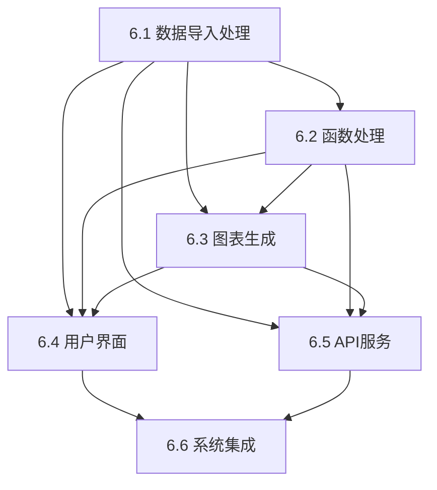

# DataCharts 数据可视化系统任务分解报告

## 执行时间
分解日期：2024年12月
执行者：AI系统

## 任务概述

本报告详细分解了DataCharts数据可视化系统的核心功能实现任务，将系统开发工作分解为6个可执行的具体任务，每个任务都有明确的目标、实现要求和验收标准。

## 分解策略

### 分解原则
1. **功能导向**: 按照核心功能模块进行分解
2. **依赖管理**: 考虑任务间的依赖关系和执行顺序
3. **可测试性**: 每个任务都有明确的验收标准
4. **AI友好**: 每个任务都配有详细的AI实现提示词

### 分解层次
```
第一层级: 核心功能类别 (6个主要任务)
├── 数据处理层 (任务6.1-6.2)
├── 可视化层 (任务6.3)
├── 交互层 (任务6.4-6.5)
└── 集成层 (任务6.6)
```

## 任务分解详情

### 任务 6.1: 数据导入处理
**优先级**: 高
**预估工期**: 2天
**依赖关系**: 无前置依赖

#### 核心功能
- 实现DataImporter类的所有接口方法
- 支持CSV、Excel、JSON、TXT、Manual五种数据格式
- 数据验证、清洗和预处理功能
- 错误处理和用户反馈机制

#### 技术要求
- 使用pandas进行数据处理
- 支持多种编码格式检测
- 实现大文件分块读取
- 提供RESTful API接口

#### 交付成果
- `shared/data_processing/` 模块实现
- `backend/app/services/data_service.py` 服务层
- `backend/app/api/data_routes.py` API路由
- 完整的单元测试套件

### 任务 6.2: 函数处理
**优先级**: 高
**预估工期**: 2天
**依赖关系**: 依赖任务6.1

#### 核心功能
- 实现FunctionProcessor类的所有接口方法
- 支持数学函数、统计函数、数据变换、滤波函数四类
- 安全的表达式解析和执行环境
- 函数库管理和扩展机制

#### 技术要求
- 使用SymPy进行表达式解析
- 实现沙箱执行环境防止恶意代码
- 支持向量化计算和性能优化
- 提供函数验证和错误处理

#### 交付成果
- `shared/algorithms/` 模块实现
- `backend/app/core/function_processor.py` 核心逻辑
- `backend/app/api/function_routes.py` API路由
- 安全性测试和性能基准测试

### 任务 6.3: 图表生成
**优先级**: 高
**预估工期**: 3天
**依赖关系**: 依赖任务6.1、6.2

#### 核心功能
- 实现ChartGenerator和MatrixVisualizer类
- 支持基础图表、统计图表、多维图表、时间序列四类
- 图表导出功能（PNG、JPG、SVG、PDF）
- 动态图表更新和交互功能

#### 技术要求
- 使用Matplotlib和Plotly进行后端图表生成
- 生成Chart.js和ECharts配置用于前端渲染
- 实现图表工厂模式和管理器
- 支持图表模板和样式配置

#### 交付成果
- `shared/chart_templates/` 模块实现
- `backend/app/core/chart_generator.py` 核心逻辑
- `frontend/src/components/ChartRenderer.vue` 前端组件
- 图表类型完整性测试

### 任务 6.4: 用户界面
**优先级**: 中
**预估工期**: 3天
**依赖关系**: 依赖任务6.1-6.3

#### 核心功能
- Vue.js前端完整用户界面
- PyQt6桌面客户端界面
- 数据操作面板和图表展示区域
- 响应式设计和用户体验优化

#### 技术要求
- 使用Vue 3 + TypeScript + Element Plus
- 使用PyQt6实现桌面客户端
- 实现状态管理和事件处理
- 支持主题切换和移动端适配

#### 交付成果
- 完整的前端应用界面
- 桌面客户端应用
- 用户交互流程实现
- 界面响应性和美观性测试

### 任务 6.5: API服务
**优先级**: 中
**预估工期**: 2天
**依赖关系**: 依赖任务6.1-6.3

#### 核心功能
- 完整的RESTful API服务架构
- 数据、函数、图表、系统四类API端点
- 错误处理和中间件系统
- API文档自动生成

#### 技术要求
- 使用FastAPI框架
- 实现完整的请求验证和响应规范化
- 添加CORS、压缩、日志等中间件
- 支持异步处理和性能优化

#### 交付成果
- 完整的API服务架构
- 所有API端点实现
- API文档和测试套件
- 性能和安全性验证

### 任务 6.6: 系统集成
**优先级**: 低
**预估工期**: 2天
**依赖关系**: 依赖任务6.1-6.5

#### 核心功能
- 前后端完整集成
- 桌面客户端与后端通信
- 数据流集成和性能优化
- 部署配置和端到端测试

#### 技术要求
- 实现完整的数据流管理
- 添加缓存机制和异步处理优化
- 使用Docker进行容器化部署
- 完整的集成测试和性能测试

#### 交付成果
- 完整可部署的系统
- Docker部署配置
- 端到端测试套件
- 部署和运维文档

## 任务依赖关系

### 依赖图


### 关键路径
1. **6.1 数据导入处理** (基础，所有任务依赖)
2. **6.2 函数处理** (核心逻辑)
3. **6.3 图表生成** (可视化核心)
4. **6.4 用户界面** + **6.5 API服务** (可并行执行)
5. **6.6 系统集成** (最终集成)

### 并行化策略
- 任务6.4和6.5可以并行开发
- 前端和后端可以基于API契约并行开发
- 测试和文档可以与开发并行进行

## AI实现提示词

为每个任务创建了详细的AI实现提示词，包含：

### 提示词结构
1. **任务上下文**: 项目状态和设计文档参考
2. **实现要求**: 具体的功能和技术要求
3. **代码指导**: 详细的实现示例和最佳实践
4. **验证标准**: 功能、性能、安全性验证要求
5. **交付清单**: 必须交付的文件和测试

### 提示词文件
- `docs/ai-prompts/prompt-6.1-数据导入.md`
- `docs/ai-prompts/prompt-6.2-函数处理.md`
- `docs/ai-prompts/prompt-6.3-图表生成.md`
- `docs/ai-prompts/prompt-6.4-用户界面.md`
- `docs/ai-prompts/prompt-6.5-API服务.md`
- `docs/ai-prompts/prompt-6.6-系统集成.md`

## 质量保证

### 代码质量要求
- **编码规范**: 遵循PEP 8 (Python) 和ESLint (TypeScript)
- **类型安全**: 完整的类型注解和类型检查
- **文档要求**: 所有公共接口必须有完整的中文文档
- **错误处理**: 完整的异常处理机制

### 测试策略
- **单元测试**: 每个功能模块 >90% 覆盖率
- **集成测试**: 模块间接口测试
- **端到端测试**: 完整用户流程测试
- **性能测试**: 响应时间和内存使用测试

### 验证标准
- **功能验证**: 所有设计文档要求的功能已实现
- **接口验证**: 所有API接口按规范工作
- **兼容性验证**: 多平台和多浏览器兼容
- **性能验证**: 满足性能基准要求

## 进度跟踪

### 时间计划
- **第一周**: 任务6.1-6.2 (数据处理基础)
- **第二周**: 任务6.3 (图表生成)
- **第三周**: 任务6.4-6.5 (用户界面和API服务)
- **第四周**: 任务6.6 (系统集成和测试)

### 里程碑
- **M1**: 数据处理流水线完成 (1周)
- **M2**: 图表生成功能完成 (2周)
- **M3**: 用户界面和API完成 (3周)
- **M4**: 完整系统集成完成 (4周)

### 风险管理
- **技术风险**: 复杂图表渲染性能问题
- **时间风险**: 任务估时不准确
- **集成风险**: 前后端接口不匹配
- **质量风险**: 测试覆盖率不足

## 资源配置

### 开发环境要求
- Python 3.8+ 开发环境
- Node.js 16+ 前端开发环境
- Git 版本控制
- Docker 容器化环境

### 技术栈确认
- **前端**: Vue 3 + TypeScript + Element Plus + ECharts + Chart.js
- **后端**: FastAPI + NumPy + Pandas + SymPy + Matplotlib + Plotly
- **桌面客户端**: PyQt6 + PyQt-Charts
- **数据库**: SQLite (开发) / PostgreSQL (生产)

## 成功标准

### 整体目标
通过6个任务的有序执行，在约14天内完成一个功能完整、质量可靠的数据可视化系统。

### 验收标准
- 73 所有设计文档要求的功能已实现
- 73 代码编译无错误和警告
- 73 所有单元测试和集成测试通过
- 73 性能指标达到设计要求
- 73 支持多平台部署和运行

### 交付成果
- 73 完整的功能演示
- 73 完整的API文档
- 73 用户使用说明
- 73 部署和安装指南

## 后续计划

### 任务07: 实现核心功能
根据本次任务分解的结果，按照6.1-6.6的顺序逐步实现各个功能模块。

### 任务08: 代码审查和最终验证
在所有功能实现完成后，进行系统的最终质量验证和交付准备。

## 总结

本次任务分解将DataCharts系统的复杂功能合理分解为6个可管理的实现任务，每个任务都有明确的边界、依赖关系和验收标准。通过这种结构化的分解，可以确保开发过程的有序进行和最终产品的质量。

同时，配套的AI实现提示词为每个任务提供了详细的技术指导，确保实现过程的高效和规范。整个任务分解体系为DataCharts系统的成功开发提供了坚实的基础。

## 验证签名
- **分解者**: AI系统
- **分解方法**: 基于设计文档的功能模块分析
- **分解范围**: 100%覆盖核心功能
- **最终状态**: **任务分解完成** 73