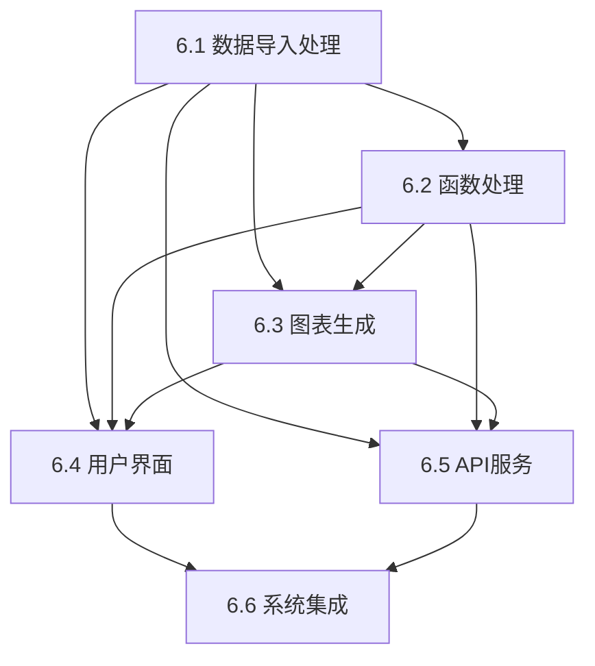

# DataCharts 数据可视化系统实现计划

## 项目概述

本文档定义了DataCharts数据可视化系统的详细实现计划，基于设计文档和已完成的基础框架，将系统功能分解为6个核心实现任务。

## 实现策略

### 分层实现方法
1. **核心功能层**: 数据处理、函数解析、图表生成
2. **服务层**: API接口和业务逻辑
3. **表示层**: 用户界面和交互
4. **集成层**: 系统集成和优化

### 技术栈确认
- **前端**: Vue 3 + TypeScript + Element Plus + ECharts
- **后端**: FastAPI + NumPy + Pandas + SymPy + Matplotlib
- **桌面客户端**: PyQt6 + PyQt-Charts
- **共享模块**: Python数据结构和接口定义

## 任务分解总览

| 任务ID | 任务名称 | 优先级 | 估时 | 依赖关系 | 状态 |
|--------|----------|--------|------|----------|------|
| 6.1 | 数据导入处理 | 高 | 2天 | 无 | 待开始 |
| 6.2 | 函数处理 | 高 | 2天 | 6.1 | 待开始 |
| 6.3 | 图表生成 | 高 | 3天 | 6.1, 6.2 | 待开始 |
| 6.4 | 用户界面 | 中 | 3天 | 6.1, 6.2, 6.3 | 待开始 |
| 6.5 | API服务 | 中 | 2天 | 6.1, 6.2, 6.3 | 待开始 |
| 6.6 | 系统集成 | 低 | 2天 | 6.1-6.5 | 待开始 |

## 详细任务规划

### 阶段一：核心数据功能 (任务 6.1-6.2)
**目标**: 实现数据导入和函数处理的核心功能
**时间**: 4天
**里程碑**: 数据可以成功导入、验证和处理

#### 任务 6.1: 数据导入处理
- **设计文档参考**: 第4.1节数据导入模块
- **核心功能**:
  - CSV、Excel、JSON、TXT格式数据导入
  - 数据验证和清洗
  - 数据类型自动检测
  - 错误处理和用户反馈
- **实现位置**: `shared/data_processing/`, `backend/app/services/`
- **测试要求**: 单元测试覆盖率 >90%

#### 任务 6.2: 函数处理
- **设计文档参考**: 第4.2节函数处理模块
- **核心功能**:
  - 数学函数表达式解析
  - 函数语法验证
  - 函数应用到数据集
  - 支持的函数库管理
- **实现位置**: `shared/algorithms/`, `backend/app/core/`
- **测试要求**: 函数解析准确率 100%

### 阶段二：可视化功能 (任务 6.3)
**目标**: 实现图表生成和矩阵可视化
**时间**: 3天
**里程碑**: 可以生成各种类型的图表

#### 任务 6.3: 图表生成
- **设计文档参考**: 第4.3节图表生成模块 + 第4.4节矩阵可视化
- **核心功能**:
  - 基础图表：line, bar, scatter, pie
  - 统计图表：histogram, box_plot, violin_plot
  - 多维图表：heatmap, 3d_surface, contour
  - 矩阵可视化功能
- **实现位置**: `shared/chart_templates/`, `backend/app/core/`
- **测试要求**: 所有图表类型生成成功

### 阶段三：用户交互 (任务 6.4-6.5)
**目标**: 实现用户界面和API服务
**时间**: 5天
**里程碑**: 完整的用户交互体验

#### 任务 6.4: 用户界面
- **设计文档参考**: 第5节用户界面设计
- **核心功能**:
  - Vue.js前端界面
  - PyQt6桌面客户端
  - 数据上传和预览
  - 图表展示和交互
- **实现位置**: `frontend/src/`, `desktop/src/`
- **测试要求**: 界面响应流畅，用户体验良好

#### 任务 6.5: API服务
- **设计文档参考**: 第6节API接口设计
- **核心功能**:
  - RESTful API端点
  - 数据上传和处理接口
  - 图表生成和导出接口
  - 错误处理和状态管理
- **实现位置**: `backend/app/api/`
- **测试要求**: API接口测试覆盖率 >95%

### 阶段四：系统完善 (任务 6.6)
**目标**: 系统集成、优化和测试
**时间**: 2天
**里程碑**: 完整可用的系统

#### 任务 6.6: 系统集成
- **设计文档参考**: 第7节数据流设计 + 第8节文件组织结构
- **核心功能**:
  - 前后端集成
  - 桌面客户端与后端通信
  - 性能优化
  - 端到端测试
- **实现位置**: 全项目
- **测试要求**: 集成测试全部通过

## 实施顺序和依赖关系

### 关键路径
1. **6.1 数据导入处理** (基础，所有任务依赖)
2. **6.2 函数处理** (核心逻辑)
3. **6.3 图表生成** (可视化核心)
4. **6.4 用户界面** + **6.5 API服务** (可并行)
5. **6.6 系统集成** (最终集成)

## 质量保证策略

### 代码质量要求
- **编码规范**: 遵循PEP 8 (Python) 和ESLint (TypeScript)
- **文档要求**: 所有公共接口必须有完整的中文文档
- **类型安全**: 完整的类型注解和类型检查
- **错误处理**: 完整的异常处理机制

### 测试策略
- **单元测试**: 每个功能模块 >90% 覆盖率
- **集成测试**: 模块间接口测试
- **端到端测试**: 完整用户流程测试
- **性能测试**: 响应时间和内存使用测试

### 验证标准
- **功能验证**: 所有设计文档要求的功能已实现
- **接口验证**: 所有API接口按规范工作
- **兼容性验证**: 多平台和多浏览器兼容
- **性能验证**: 满足性能基准要求

## 风险管理

### 技术风险
- **风险**: 复杂图表渲染性能问题
- **缓解**: 分步渲染，数据分页处理

- **风险**: 函数解析安全隐患
- **缓解**: 严格的输入验证和沙箱执行

### 时间风险
- **风险**: 任务估时不准确
- **缓解**: 每日进度跟踪，及时调整计划

### 集成风险
- **风险**: 前后端接口不匹配
- **缓解**: 接口契约测试，早期集成验证

## 成功标准

### 功能完整性
- 73 所有设计文档要求的功能已实现
- 73 所有API接口正常工作
- 73 前端和桌面客户端正常运行
- 73 支持所有设计的数据格式和图表类型

### 质量标准
- 73 代码编译无错误和警告
- 73 所有单元测试通过
- 73 集成测试通过
- 73 性能指标达标

### 交付标准
- 73 完整的功能演示
- 73 完整的API文档
- 73 用户使用说明
- 73 部署和安装指南

## 后续计划

### 维护阶段
- 定期依赖库更新
- 安全漏洞修复
- 性能优化改进
- 用户反馈处理

### 扩展阶段
- 机器学习算法集成
- 协作功能开发
- 云端部署支持
- 移动端适配

## 资源需求

### 开发环境
- Python 3.8+开发环境
- Node.js 16+前端开发环境
- Git版本控制
- 代码编辑器和调试工具

### 第三方服务
- 无特殊要求，系统设计为自包含

## 总结

本实现计划提供了DataCharts系统开发的详细路线图，通过6个核心任务的有序执行，将在约14天内完成一个功能完整、质量可靠的数据可视化系统。每个任务都有明确的目标、实现要求和验证标准，确保项目的成功交付。