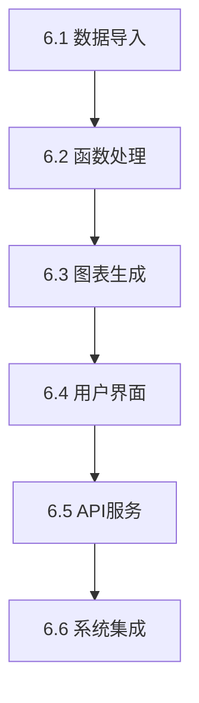

# 任务 06: 生成实现任务分解

## 任务描述
基于设计文档和现有代码框架，为数据可视化系统功能实现生成详细的任务分解。创建具有特定AI辅助开发提示词的颗粒化实现任务。

## 前置条件
- 任务 05 成功完成且状态为通过
- 数据可视化基础框架编译成功
- 数据可视化设计文档可用
- 理解所需的系统功能

## 任务目标
1. 分析数据可视化设计文档中所需的功能
2. 创建实现的分层任务分解
3. 为每个实现任务生成特定提示词
4. 建立任务依赖关系和执行顺序
5. 创建实现文档结构

## 详细步骤

### 步骤 1: 功能分析
```bash
# 分析设计文档中的功能要求
find docs/tasks -name "*设计文档*" -type f | xargs grep -l "功能\|接口\|API"
```

识别所需功能：
- **数据导入模块**: 支持多种格式的数据导入功能
- **函数处理模块**: 数学函数解析和应用功能
- **图表生成模块**: 各种类型图表的生成功能
- **矩阵可视化**: 多维数据的可视化功能
- **用户界面**: 前端和桌面客户端界面
- **API服务**: 后端RESTful API服务

### 步骤 2: 创建实现任务层次结构

#### 第一层级: 核心功能类别
1. **数据导入和处理**
2. **函数解析和计算** 
3. **图表生成和渲染**
4. **用户界面实现**
5. **API服务实现**
6. **系统集成和优化**

#### 第二层级: 详细任务分解
为每个类别创建具体实现任务：

### 步骤 3: 生成任务文档结构
```bash
# 创建实现文档目录
mkdir -p code/DataCharts-System/docs/implementation-tasks
```

### 步骤 4: 创建个人任务文件

#### 任务 6.1: 数据导入和处理实现
创建 `implementation-tasks/task-6.1-数据导入处理.md`:

```markdown
# 任务 6.1: 数据导入和处理实现

## 目标
实现数据可视化系统的数据导入和处理功能。

## 设计文档参考
- 第 4.1 节：数据导入模块
- 第 5.1 节：用户界面设计
- 第 6.1 节：API接口设计

## 实现要求

### 需要实现的功能
1. `DataImportInterface.import_data()`: 数据导入功能
2. `DataImportInterface.validate_data()`: 数据验证功能
3. 支持的数据格式：CSV、Excel、JSON、TXT
4. 数据预处理和清洗功能

### 实现步骤
1. 实现数据格式检测逻辑
2. 实现各种格式的数据解析器
3. 实现数据验证和清洗逻辑
4. 实现错误处理机制
5. 添加数据预览功能

### 成功标准
- 所有数据导入功能已实现
- 数据验证正常工作
- 支持所有指定的数据格式
- 适当的错误处理
- 单元测试通过
```

#### 任务 6.2: 函数解析和计算实现  
创建 `implementation-tasks/task-6.2-函数处理.md`:

```markdown
# 任务 6.2: 函数解析和计算实现

## 目标
实现数据可视化系统的函数解析和数学计算功能。

## 设计文档参考
- 第 4.2 节：函数处理模块
- 第 7 节：数据流设计

## 实现要求

### 需要实现的功能
1. `FunctionProcessorInterface.parse_expression()`: 函数表达式解析
2. `FunctionProcessorInterface.apply_function()`: 函数应用到数据
3. 支持的函数类型：数学函数、统计函数、数据变换、滤波函数
4. SymPy 集成用于符号计算

### 实现步骤
1. 实现表达式语法解析器
2. 实现函数库和函数注册机制
3. 实现安全的函数执行环境
4. 实现数据应用逻辑
5. 优化计算性能

### 成功标准
- 函数解析算法正确实现
- 函数应用符合设计规范
- 支持所有指定的函数类型
- 性能满足要求
- 覆盖所有处理路径的单元测试
```

#### 任务 6.3: 图表生成和渲染实现
创建类似的任务文件：
- `task-6.3-图表生成.md`
- `task-6.4-用户界面.md`
- `task-6.5-API服务.md`
- `task-6.6-系统集成.md`

### 步骤 5: 创建主实现计划
创建 `code/DataCharts-System/docs/implementation-plan.md`:

```markdown
# 数据可视化系统实现计划

## 概述
本文档概述了数据可视化系统功能的完整实现计划。

## 实现阶段

### 阶段 1: 核心基础设施 (任务 6.1-6.2)
**持续时间**: [预估时间]
**依赖关系**: 基础框架（任务 1-5）
**交付物**:
- 数据导入和处理功能
- 函数解析和计算功能

### 阶段 2: 可视化功能 (任务 6.3)  
**持续时间**: [预估时间]
**依赖关系**: 阶段 1 完成
**交付物**:
- 图表生成和渲染功能
- 多种图表类型支持

### 阶段 3: 用户界面 (任务 6.4)
**持续时间**: [预估时间]  
**依赖关系**: 阶段 2 完成
**交付物**:
- Vue.js 前端界面
- PyQt6 桌面客户端

### 阶段 4: API和集成 (任务 6.5-6.6)
**持续时间**: [预估时间]
**依赖关系**: 阶段 3 完成
**交付物**:
- 完整的 RESTful API
- 系统集成和优化

## 任务依赖关系


## 实现指南

### 技术要求
- 前端使用 Vue 3 + TypeScript
- 后端使用 Python FastAPI
- 桌面客户端使用 PyQt6
- 数据处理使用 NumPy, Pandas
- 函数解析使用 SymPy
- 图表使用 PyQt-Charts 和 Chart.js/ECharts

### 质量要求
- 每个模块包含完整的文档注释
- 实现必要的类型定义和接口
- 包含使用示例
- 遵循设计文档接口规范
- 全面的单元测试覆盖

### 验证过程
1. 每个任务完成后必须编译成功
2. 每个任务必须通过所有单元测试
3. 实现必须与设计文档完全匹配
4. 标记任务完成前需要代码审查
```

### 步骤 6: 生成任务提示词
为每个实现任务创建AI就绪的提示词：

创建 `code/DataCharts-System/docs/ai-prompts/` 目录并包含提示词文件：

```markdown
# prompt-6.1-数据导入.md

## AI 实现提示词

您正在实现数据可视化系统的数据导入和处理功能。 

**上下文**: 
- 数据可视化基础框架存在于 code/DataCharts-System/
- 设计文档在第 4.1 节指定了数据导入要求
- 当前代码有需要实现的骨架函数

**任务**: 
根据设计规范在 shared/interfaces.py 中实现以下功能：
- DataImportInterface.import_data()
- DataImportInterface.validate_data()
- 支持 CSV、Excel、JSON、TXT 格式

**要求**:
- 严格遵循设计文档
- 实现适当的错误处理
- 添加全面的文档
- 包含单元测试
- 确保编译通过

**输出**:
- 更新的 shared/interfaces.py 和相关实现
- backend/app/ 中的后端服务实现
- tests/ 目录中的新测试文件
```

## 成功标准
- [ ] 数据可视化设计文档已分析功能要求
- [ ] 创建了包含6+实现任务的分层任务分解
- [ ] 为每个实现领域创建了个人任务文档
- [ ] 生成了包含阶段和依赖关系的主实现计划
- [ ] 为每个实现任务创建了AI就绪提示词
- [ ] 任务文档保存在 `code/DataCharts-System/docs/implementation-tasks/`
- [ ] 实现计划为开发阶段提供明确指导

## 输出文件
- `code/DataCharts-System/docs/implementation-tasks/`: 包含个人任务文件的目录
- `code/DataCharts-System/docs/implementation-plan.md`: 主实现计划
- `code/DataCharts-System/docs/ai-prompts/`: AI就绪实现提示词
- 任务文件：`task-6.1-数据导入.md` 到 `task-6.6-系统集成.md`

## 触发机制
此任务可通过以下方式触发：
1. 手动执行：分析设计文档并手动创建任务分解
2. 脚本执行：`./task-runner.sh 06`
3. AI辅助：使用AI分析设计文档并生成结构化任务分解

## 下一任务
成功完成后，继续执行 **07-实现核心功能.md** 进行逐步实现。

## 注意事项
- 任务分解应该足够颗粒化以进行AI辅助实现
- 每个任务应该有明确的成功标准和验证步骤
- 实现顺序应该尊重功能依赖关系
- 所有任务必须引用特定的设计文档部分